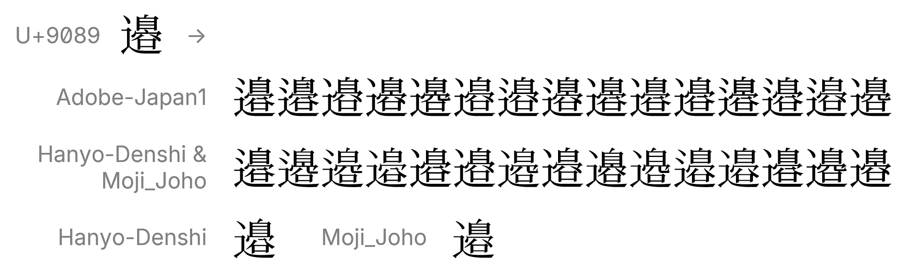
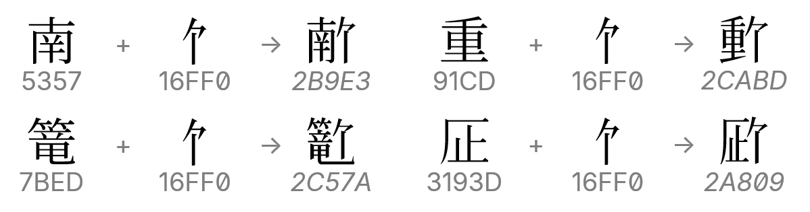
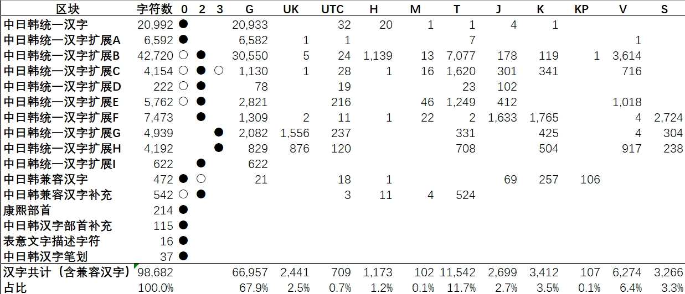

# SuperHan系列字库（公测）
一套以[思源宋体](https://github.com/adobe-fonts/source-han-serif)及[修改版Kage引擎](https://github.com/ge9/kage-engine-2/)生成的汉字为主进行二次开发的大字符集宋体字库，字形主要以中国大陆地区字形标准呈现。

### SuperHan Font series (Public Beta)

A large character set Songti(Mincho) fonts mainly derived by [Source Han Serif](https://github.com/adobe-fonts/source-han-serif) and Han glyphs generated by [modified Kage engine](https://github.com/ge9/kage-engine-2/), and the glyphs are mainly presented in China mainland glyphs standard(aka G source).
## 文件构成
### 字体文件
- `ttf/SuperHan[0|2|3]ivd.ttf` 三个单独的TrueType字体文件，每个字体文件包含对应平面的字符，数字代表平面编号。 
（0—BMP，基本多文种平面；2—SIP，扩展表意文字平面；3—TIP，表意文字第三平面）
- `ttf/SuperHanivd.ttc` 包含以上三个字体的整合包。
> 一般用户仅需在上面的三个TTF文件或者单个TTC文件中任选一组安装即可。
- `woff/*.woff`、`woff2/*.woff2` 以上三个字体的网络字体（Webfont）形式，方便网站调用。
### 文档
- `doc/superhantest.pdf` 列举该字体支持的所有汉字字符。
- `doc/superhanivd.pdf` 列举该字体支持的标准异体序列（SVS）字形及表意文字异体序列（IVS）字形。
## 字体功能介绍
1. 包含现今Unicode标准（Version 15.1）定义的所有汉字（97,680统一汉字+1,002兼容汉字）及部分与汉字相关的符号，字体覆盖的汉字已满足GB 18030-2022实现级别3所定义的范围；
2. 包含现今Unicode标准（Version 15.1）定义的所有[标准异体序列（SVS）](https://www.unicode.org/versions/Unicode15.0.0/ch23.pdf#page=20)汉字字形（1,002个）和[表意文字异体序列（IVS）](https://www.unicode.org/reports/tr37/)字形（29,437个）；
 
> **标准异体序列（SVS）字形及表意文字异体序列（IVS）字形的调用方法：**
> 
> 在基本汉字字符的后面再加对应的变体选择符（`U+FE00..FE0F,E0100..E01EF`）就可得到该异体字字形。
3. 该字体汉字的字形主要以中国大陆地区字形（即G源）标准呈现，若汉字不存在G源，则汉字的字形标准按照以下顺序呈现： 
$$\textbf{G}>\textbf{UK}>\text{UTC}>\text{H}>\text{M}>\text{T}>\text{J}>\text{K}>\text{KP}>\text{V}>\text{SAT}$$
4. 在部分汉字的后面加入越南语备选读音标记Ca“ 𖿰”(VIETNAMESE ALTERNATE READING MARK CA, U+16FF0, 形如“亇”)，可组合生成一个汉字字形。
 
## 字体授权
本字体以[SIL Open Font License（SIL开放字体协议）](https://openfontlicense.org/open-font-license-official-text/)授权形式发布。

授权协议的中文文本参考（非官方译本）：https://www.maoken.com/ofl

### 您可以：
- 任何个人、团体、组织及企业可免费进行商业目的和非商业目的使用，无需支付费用、事先告知作者、标明来源信息或征得作者许可；
- 对字体文件进行二次发布或安装、嵌入到任何软件或设备中，同时软件或设备可被再次分发/销售；
- 对字体文件进行修改、扩充和格式转换，但修改过后的文件**必须以SIL Open Font License的授权形式**发表，同时**不得使用本字体的保留名称：SuperHan**（若仅对源字体进行格式转换可继续使用该保留名称）。

### 您不可以：
- 对字体文件中的任何部分（包括但不限于字形、OpenType特性逻辑）进行倒卖兜售，包括但不限于：将字体文件单独售卖，与其他字体进行捆绑售卖、需付费办理特殊权限才可使用字体等；
- 将字体文件中的任何部分以非SIL Open Font License授权协议发表；
- 本文未列明的，但违反SIL Open Font License授权协议的其他行为；
- 利用本字体文件或其衍生品进行危害计算机系统正常进行的行为（包括但不限于在字体文件中嵌入计算机病毒、主观故意利用程序或系统存在的BUG来扰乱计算机系统的正常运作）；
- 将本字体用作违反当地法律法规的用途。

### 其他声明
- 作者不行使、未能及时行使或未充分行使SIL Open Font License授权协议所享有的合法权利，不应被视为放弃该权利，也不影响作者在将来行使该权利；
- **本字体为免费商用字体，凡是需要付费来获得该字体的行为，都是诈骗行为，谨防上当受骗；**
- 本字体不包含任何政治意图、隐喻及目的，与一切政治活动无关。作者不承担使用该字体所产生的任何连带法律责任。
## 注意事项
- 尽管作者在制作字体时力图准确和易用性，但因技术和精力有限，无法保证字体本身数据的准确性及预期呈现效果在您的设备是否能够完美复现。因此，作者不对本字体作任何明示或暗示的保证，同时作者不承担您使用该字体所产生的任何索赔、损害或可归责事由而来的任何责任。
- 本字体包含的部分字形未完全遵循[《通用规范汉字表》](http://www.moe.gov.cn/jyb_sjzl/ziliao/A19/201306/t20130601_186002.html)所定义的字形，请注意甄别。
- 由于部分T源字形在GlyphWiki中尚无对应的字形数据，故暂使用[全字库正宋体](http://www.cns11643.gov.tw/)来填满缺失的字形，共计2,778个，涉及字符请[点击此处查看](text/t-miss.txt)。
- V源字形因无严格标准（[喃那宋](https://github.com/nomfoundation/font)在严格意义上不算为标准），故该字体的V源字形仅供参考。
- 部分不同编码的表意文字异体序列（IVS）字形在图形角度上几乎完全相同，为减少本字体的文件体积，故这些编码在字体文件中会映射到同一字形。
## 使用的工具、资料与数据
### 字体（或其生成工具）
- [思源宋体](https://github.com/adobe-fonts/source-han-serif)
- [思源宋体 Adobe-KR字符集版](https://github.com/adobe-type-tools/Adobe-KR/releases/tag/20190729)
- [Minh Nguyen](https://github.com/TKYKmori/Minh-Nguyen/)
- [思源黑体](https://github.com/adobe-fonts/source-han-sans)
- [修改版Kage引擎](https://github.com/ge9/kage-engine-2/)
- [全字库正宋体](https://data.gov.tw/dataset/5961)
### 资料与数据
- [GlyphWiki](https://zhs.glyphwiki.org/)
- [Unicode官方码表](https://www.unicode.org/charts/)
- [Unicode表意文字异体数据库](https://www.unicode.org/ivd/)
- [Unicode标准异体数据](https://www.unicode.org/Public/15.1.0/ucd/StandardizedVariants.txt)
- [Unihan相关数据库](https://www.unicode.org/Public/15.1.0/ucd/Unihan.zip)
- [字统网](https://zi.tools/)
### 字体编辑/处理工具
- [FontForge](https://fontforge.org/en-US/)
- [FontTools](https://github.com/fonttools/fonttools)
- [AFDKO](https://github.com/adobe-type-tools/afdko)
## 问题反馈与联系方式
如您在使用本字体的过程中如有任何问题和建议，欢迎大家向作者反馈。您可在GitHub或Gitee中对应项目中提交issue（严禁提交无关内容），也可以通过下列联系方式中进行反馈。
### 本项目地址
- **【更新首发】GitHub：https://github.com/takushun-wu/SuperHan**
- Gitee：https://gitee.com/takushun/SuperHan
### 联系方式
- GitHub：https://github.com/takushun-wu/
- Gitee：https://gitee.com/takushun/
- 邮箱
    * takushun-wuⓐoutlook●com
    * junny_2016ⓐqq●com
- Gmail：takushunwuⓐgmail●com
- QQ：②❽③❸⑨❹④❻①❸（添加好友请备注“**SuperHan问题反馈**”）
### 打赏支持/Sponsor
[点击进入/Click me](DONATE.md)
## 附表
### 各区块字符覆盖情况
 
**注：**
- “0”、“2”和“3”列为三个字体包含区块内字符的情况。“●”为全部支持，“○”为部分支持，留空为不支持；
- 非汉字区块不在表格统计范围内；
- “G”~“SAT”列为每个区块中各源汉字的数量统计。
### 表意文字异体序列（IVS）字形各来源统计
| 来源                        | 英文名       | 数量   |
| --------------------------- | ------------ | -----: |
| Adobe-Japan1字符集          | Adobe-Japan1 | 14,684 |
| *日本泛用电子               | Hanyo-Denshi | 13,045 |
| *日本文字情报技术促进协议会 | Moji_Joho    | 11,384 |
| 韩国人名                    | KRName       |     36 |
| 澳门特区政府                | MSARG        |    154 |

**注：** 画*的两个来源存在码位共享。